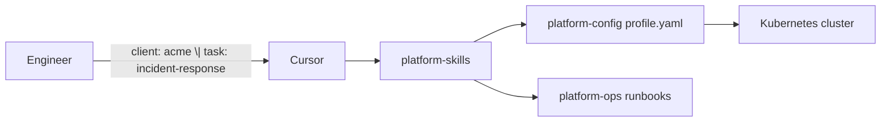

# k8s-automation

A starter kit for running Kubernetes platforms with AI-assisted operations. Built for the **PlatRel** (Platform Reliability) team, but structured so any platform engineer can pick it up.

> Personal PoC copy under `poc-playground` for individual testing. Upstream reference: Mobin's `platform-automation` repo — sync intentionally later.

If you are new here, read this page first. It explains what the repo is, how the pieces fit together, and where to go next.

---

## What is this?

Modern platform teams manage OpenShift, ROSA, EKS, policies, monitoring, and incidents across many clients. That knowledge usually lives in Slack threads, people's heads, and scattered wikis.

This repo fixes that with **three focused repositories** and **AI skills** that teach Cursor how your team works:

| Repo | What it holds | Think of it as… |
|------|---------------|-----------------|
| [platform-skills](platform-skills/) | Cursor agent skills | The team's brain for AI |
| [platform-config](platform-config/) | Kustomize bases, RHACM policies, client profiles | The source of truth for what runs |
| [platform-ops](platform-ops/) | Runbooks, SOPs, postmortems | What you do when things break |

Everything important lives in Git. If it is not in one of these repos, it does not exist.

---

## How it works (30-second version)



1. You tell Cursor: `client: acme | task: incident-response | alert: HostedClusterDegraded`
2. The agent loads **skills** (how to work), the **client profile** (Acme's platform, compliance, contacts), and **runbooks** (step-by-step fixes).
3. Changes to infrastructure go through **platform-config** via GitOps — not manual `kubectl` on production.

---

## Repo layout

```
k8s-automation/
├── README.md                 ← you are here
├── docs/
│   └── ACTION_PLAN.md        ← full build guide (10 milestones)
├── platform-skills/          ← AI skill library (.cursor/skills/)
├── platform-config/          ← IaC, profiles, ACM policies
└── platform-ops/             ← runbooks and SOPs
```

---

## Quick start for newcomers

### 1. Read the team rules (5 min)

Open [platform-skills/CONSTITUTION.md](platform-skills/CONSTITUTION.md). Three laws:

- **If it is not in Git, it does not exist**
- **Task skills compose — they never duplicate**
- **Every incident improves the system** (runbook + skill update within 48h)

### 2. Explore the reference client (10 min)

**Acme Corporation** is a fictional end-to-end example. Trace these files:

| File | What it shows |
|------|---------------|
| [platform-config/clients/acme/profile.yaml](platform-config/clients/acme/profile.yaml) | Client platform, compliance, active skills |
| [platform-config/clusters/acme-prod/cluster-info.yaml](platform-config/clusters/acme-prod/cluster-info.yaml) | Production cluster metadata |
| [platform-skills/.cursor/skills/clients/acme/SKILL.md](platform-skills/.cursor/skills/clients/acme/SKILL.md) | Client-specific AI overlay |
| [platform-ops/runbooks/rosa-hcp/hostedcluster-degraded.md](platform-ops/runbooks/rosa-hcp/hostedcluster-degraded.md) | Real runbook for ROSA HCP |

### 3. Try a Cursor prompt

With `platform-skills` in your workspace (or as a submodule):

```
client: acme | task: client-onboarding
```

```
client: acme | task: platform-health-check
```

```
client: acme | task: incident-response | alert: HostedClusterDegraded
```

### 4. Follow the onboarding bootcamp

New engineers: [platform-skills/docs/onboarding-bootcamp.md](platform-skills/docs/onboarding-bootcamp.md) — a 4-week path through all three repos.

---

## Platforms we support

| Platform | Cloud | Status |
|----------|-------|--------|
| OpenShift (OCP) | AWS, on-prem | Active |
| ROSA (classic) | AWS | Active |
| ROSA HCP (Hypershift) | AWS | Active — primary path |
| EKS | AWS | Active |
| Azure / AKS | Azure | Stub — not yet operated |

Full matrix: [platform-skills/docs/platform-matrix.md](platform-skills/docs/platform-matrix.md)

---

## Daily workflow cheat sheet

| Task | Cursor prompt |
|------|---------------|
| Start work on a client | `client: [name] \| task: client-onboarding` |
| Health check | `client: [name] \| task: platform-health-check` |
| Respond to incident | `client: [name] \| task: incident-response \| alert: [name]` |
| Write a new policy | `client: [name] \| task: policy-authoring \| policy: [what]` |

After closing an incident: update a runbook in **platform-ops**, update a skill in **platform-skills** if context was missing, link both PRs to the ticket.

---

## Adding a new client

1. Copy [platform-config/clients/_template/profile.yaml](platform-config/clients/_template/profile.yaml) → `clients/[name]/profile.yaml`
2. Fill every field — validate against [schemas/profile.schema.json](platform-config/schemas/profile.schema.json)
3. Create [platform-skills/.cursor/skills/clients/[name]/SKILL.md](platform-skills/.cursor/skills/clients/)
4. Open PRs in both repos, get review
5. Run: `client: [name] | task: client-onboarding`

---

## For builders: the action plan

The repo was bootstrapped from a 10-milestone action plan. If you need to extend the structure or understand design decisions:

→ [docs/ACTION_PLAN.md](docs/ACTION_PLAN.md)

---

## Contributing

Each sub-repo has its own `CONTRIBUTING.md` and `CODEOWNERS`. All changes go through merge requests. Skills and runbooks are reviewed against [platform-skills/governance/skill-review-checklist.md](platform-skills/governance/skill-review-checklist.md).

---

## License and ownership

Private — PlatRel platform team. Replace `[org]` placeholders in [example-app-repo](platform-skills/example-app-repo/) with your GitLab group before using submodules in production.
