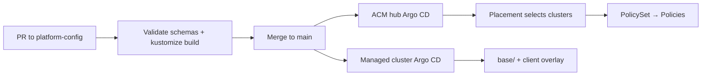

# platform-config

Infrastructure-as-code layer for the PlatRel platform team. This repo is the GitOps source of truth for cluster configuration, RHACM policies, Kustomize bases, client profiles, SLO definitions, and JSON schemas for validation.

## Repository structure

```
platform-config/
├── base/                    # Platform-specific Kustomize bases (shared across clients)
│   ├── rosa/                # ROSA / ROSA HCP — GitOps namespace, common labels
│   ├── ocp/                 # Self-managed OCP — namespaces, RBAC, operators
│   └── eks/                 # EKS base (stub)
├── acm/                     # RHACM hub resources (applied on the ACM hub cluster)
│   ├── placements/          # Placement resources — which clusters receive policies
│   ├── policy-sets/         # PolicySet — bundles policies per client
│   └── policies/            # Individual Policy CRs (vendored from policy-collection where possible)
├── clients/                 # Per-client overlays and profiles
│   ├── _template/           # Copy this to onboard a new client
│   └── acme/                # Reference mock client (Acme Corporation)
├── clusters/                # Cluster metadata (not applied as K8s resources)
│   ├── _template/           # cluster-info.yaml + contacts.yaml templates
│   └── acme-prod/           # Example production cluster
├── slos/                    # SLO definitions (PromQL indicators per client)
└── schemas/                 # JSON Schema for profile.yaml and cluster-info.yaml validation
```

### What lives where

| Path | Purpose | Applied by |
|------|---------|------------|
| `base/` | Shared platform primitives (namespaces, RBAC, operators) | OpenShift GitOps / Argo CD |
| `acm/` | Governance policies, placements, policy sets | ACM hub GitOps |
| `clients/[client]/kustomize/` | Client overlay referencing a `base/` | Cluster GitOps Application |
| `clients/[client]/policies/` | Client policy overlay referencing `acm/policies/` | ACM hub GitOps |
| `clients/[client]/profile.yaml` | Client source of truth for skills and automation | Not deployed — read by agents/CI |
| `clusters/[cluster]/` | Cluster inventory and contacts | Not deployed — documentation/ops |
| `slos/[client].yaml` | SLO targets and PromQL indicators | Referenced by observability stack |

## GitOps workflow

Changes flow from this repo to clusters via OpenShift GitOps (Argo CD). ACM resources are applied on the hub; cluster config is applied per managed cluster.



### Typical change paths

1. **New client** — Copy `clients/_template/`, fill `profile.yaml`, add `kustomize/` and `policies/` overlays, create `acm/placements/` and `acm/policy-sets/` entries, open PR.
2. **Platform base change** — Edit `base/[platform]/`, validate with `kustomize build`, affects all clients referencing that base.
3. **New ACM policy** — Add Policy CR under `acm/policies/`, reference it in the client's PolicySet, prefer vendoring from [policy-collection](https://github.com/stolostron/policy-collection).
4. **Cluster metadata** — Update `clusters/[name]/cluster-info.yaml` or `contacts.yaml`; validate against `schemas/`.

### Acme reference example

The `acme` client demonstrates the full pattern:

- Profile: `clients/acme/profile.yaml` — references `acme-policy-set` and `acme-placement`
- Cluster overlay: `clients/acme/kustomize/` → `base/rosa`
- Policy overlay: `clients/acme/policies/` → `acm/policies`
- ACM: `acm/placements/acme-placement.yaml`, `acm/policy-sets/acme-policy-set.yaml`
- Cluster info: `clusters/acme-prod/`

## Required labels

All managed resources must carry `platform.io/*` labels (see `platform-skills` core skill):

```yaml
platform.io/client: ""        # client slug
platform.io/environment: ""   # prod | nonprod | dev
platform.io/platform: ""      # ocp | rosa | rosa-hcp | eks
platform.io/managed-by: kustomize
platform.io/team: platrel
```

Client-specific values (`client`, `environment`) are set in overlays; bases set `team`, `managed-by`, and `platform`.

## Related repos

- **platform-skills** — AI skill library; loads `profile.yaml` to resolve client context
- **platform-ops** — Runbooks, SOPs, postmortems referenced from client profiles

## Getting started

See [CONTRIBUTING.md](CONTRIBUTING.md) for validation steps and the PR process.
